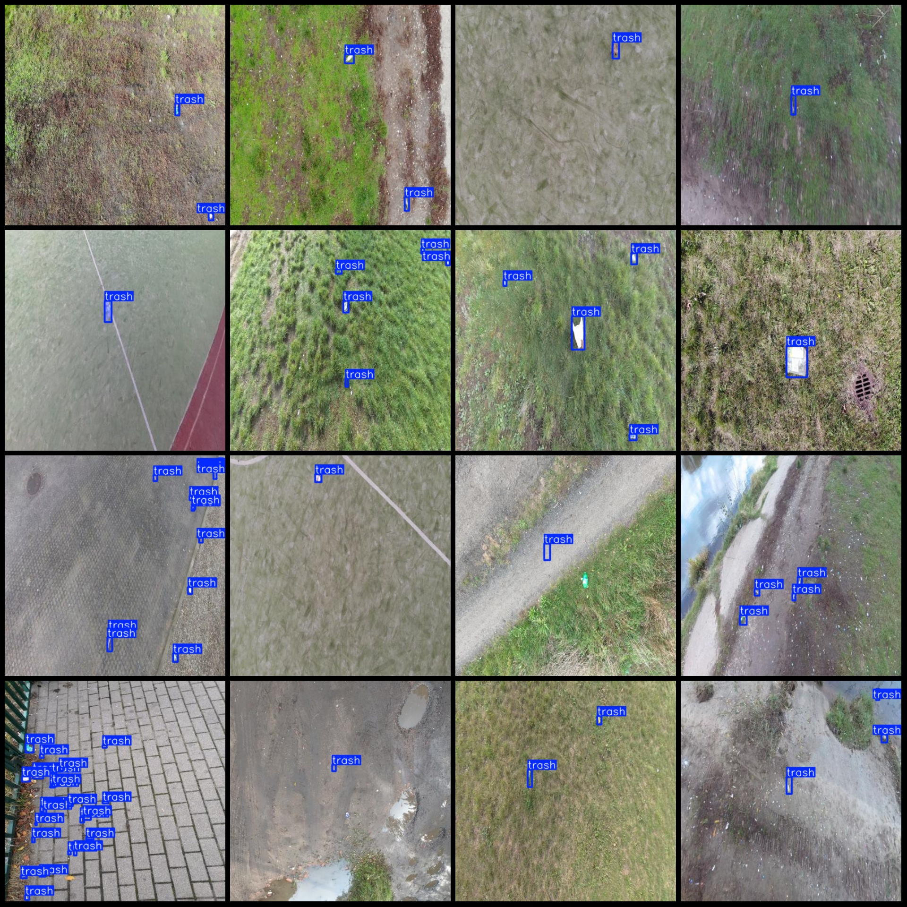
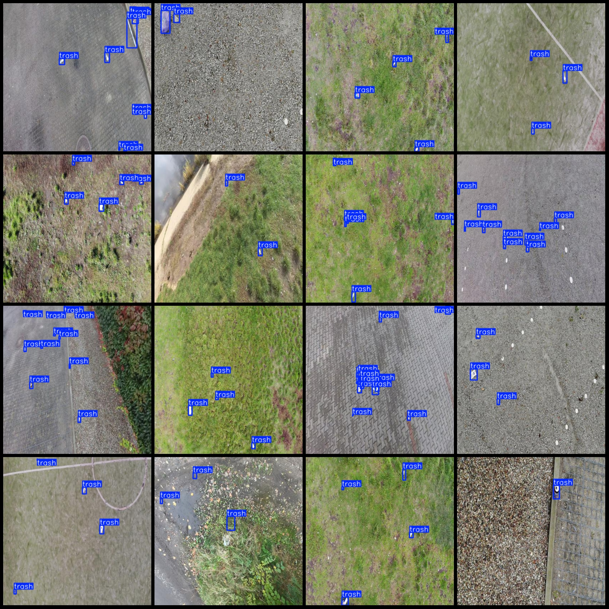

# UAV Viewpoint Lawn Roadside Waste Detection Dataset VOC+YOLO Format 700 Images 1 Category

The dataset format: Pascal VOC format + YOLO format (without the split path of the txt file, only containing jpg images as well as the corresponding VOC format xml files and YOLO format txt files).

Number of images (jpg file count): 770
Number of annotations (xml file count): 770
Number of annotations (txt file count): 770
Number of annotation categories: 1
Annotation category name: "trash"
Number of bounding box per category:
- Trash: 3692
Total number of bounding boxes: 3692
Number of images occupied by each category:
- Trash: 770
Image resolution: 416x416
Drone: DJI MAVIC 3
Collection height: 3-10m
Collection angle: 60-90°
Annotation tool used: labelImg
Annotation rules: draw a rectangle around the category.
Important note: The dataset does not have been divided into training validation test sets; you need to do that yourself.
Special declaration: This dataset does not guarantee the accuracy of the trained models or the weight files.
Image preview:
Annotation example:
## IMAGE

Here is a pay link on Stripe ( https://buy.stripe.com/3cs8yP7sY87d0vu9AB ). Please contact me lonlonago@foxmail.com after funding $89, and I will send you a complete data files , thank you!

